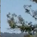

# Vehicle Detection

The objective of this project is to create a pipeline (model) to draw bounding boxes around cars in a video. This video was taken from a camera mounted on the front of a car.

This README contains info on:

## 1. Files in this repo
* `Vehicle_Detection.ipynb`: Notebook with all the project work
*  README (repo and process documentation):
   * `README.md`: This doc!
   * `readme_images/`: Contains images used in this doc
   * `output_images/`: Output of pipeline and other relevant images
* Given resources:
   * `test_images`: Images provided by Udacity to test my model on

## 2. Project Outline
The goals / steps of this project are the following:

* Perform a Histogram of Oriented Gradients (HOG) feature extraction on a labeled training set of images and train a classifier Linear SVM classifier
* Optionally, you can also apply a color transform and append binned color features, as well as histograms of color, to your HOG feature vector. 
* Note: for those first two steps don't forget to normalize your features and randomize a selection for training and testing.
* Implement a sliding-window technique and use your trained classifier to search for vehicles in images.
* Run your pipeline on a video stream and create a heat map of recurring detections frame by frame to reject outliers and follow detected vehicles.
* Estimate a bounding box for vehicles detected.

Here are links to the labeled data for [vehicle](https://s3.amazonaws.com/udacity-sdc/Vehicle_Tracking/vehicles.zip) and [non-vehicle](https://s3.amazonaws.com/udacity-sdc/Vehicle_Tracking/non-vehicles.zip) examples to train your classifier.  These example images come from a combination of the [GTI vehicle image database](http://www.gti.ssr.upm.es/data/Vehicle_database.html), the [KITTI vision benchmark suite](http://www.cvlibs.net/datasets/kitti/), and examples extracted from the project video itself.   You are welcome and encouraged to take advantage of the recently released [Udacity labeled dataset](https://github.com/udacity/self-driving-car/tree/master/annotations) to augment your training data.  

Some example images for testing your pipeline on single frames are located in the `test_images` folder.  To help the reviewer examine your work, please save examples of the output from each stage of your pipeline in the folder called `ouput_images`, and include them in your writeup for the project by describing what each image shows.    The video called `project_video.mp4` is the video your pipeline should work well on.  

**As an optional challenge** Once you have a working pipeline for vehicle detection, add in your lane-finding algorithm from the last project to do simultaneous lane-finding and vehicle detection!

**If you're feeling ambitious** (also totally optional though), don't stop there!  We encourage you to go out and take video of your own, and show us how you would implement this project on a new video!

## 3. Project Process
### I. Histogram of Oriented Gradients (HOG)

#### 1. Extract HOG features from the training images.

1. Read in all `vehicle` and `non-vehicle` images.
Here are two example images, the first from the `vehicle` class and the second from the `non-vehicle` class:
    * 
    * 

2. Use `skimage.feature.hog(training_image, [parameters=parameter_values])` to extract HOG features and HOG visualisation.
* I took a random image and varied the three parameters of `orientations`, `pixels_per_cell` and `cells_per_block` while using a gray version of the image. Code is present in `cell 28` of Ipython notebook. Some of the results are pasted below:

* I choose HOG parameters mainly based on visual inspection of output image. I tried to see which parameter combination captured the shape of car pretty well.I also tried using classifier performance also to determine parameter values but it didn't vary much. Finally I used `orientations = 9`, `pixels_per_cell = (8,8)` and `cells_per_block = (2,2)` as they looked good enough from visual perspective.

#### 3. Train a classifier using selected HOG features and colour features.

1. Format features using `np.vstack` and `StandardScaler()`.
2. Split data into shuffled training and test sets. 
3. Train linear SVM using `sklearn.svm.LinearSVC()`.

Code can be found in `Cell 29` and `Cell 30` of the notebook. 

**Observation** : In this case, model accuracy came out to be more than 99% in most of the cases. The major issue was with random splitting of train/test data. Images in the subfolders were highly correlated with each other. Due to this, performance of the classifier was highly dependent on the selection of train and test data. Ideally, I should have trained the classifier on few subfolders and used other subfolders for testing. However, in interest of time, I skipped that step.

### II. Sliding Window Search

#### 1. Implement a sliding window search.

1. I used the function `detect_vehicles` defined in `Cell 22` of the notebook using helper function `slide_window` defined in `Cell 21`
2. We need smaller windows to detect objects farther from car and larger windows to detect images nearer to the car. In this regard, I designed windows of three different sizes. Also, I used different overlaps for all the three sizes to capture the maximum variation within the image. Finally, I restricted search space to lower half of the image (altered value of variable `y_start_stop`) because cars only appear on the road and not in the sky.
3.  Implement sliding window search using helper function `search_windows`.
    * For each window, 
        * extract features for that window, 
        * scale extracted features to be fed to the classifier, 
        * predict whether the window contains a car using our trained Linear SVM classifier, 
        * and save the window if the classifier predicts there is a car in that window.

Window 1 (Parameters for `slide_window` function): 
* `y_start_stop = [395,650]`
* `xy_window = (128,96)`
* `xy_overlap =  (0.5,0.5)`

Window 2 (Parameters for `slide_window` function): 
* `y_start_stop = [395,650]`
* `xy_window = (96,96)`
* `xy_overlap =  (0.8,0.8)`

Window 3 (Parameters for `slide_window` function): 
* `y_start_stop = [395,550]`
* `xy_window = (48,48)`
* `xy_overlap =  (0.45,0.45)`

#### 2. Show some examples of test images to demonstrate how your pipeline is working.  What did you do to try to minimize false positives and reliably detect cars?

Ultimately I searched on two scales using YCrCb 3-channel HOG features plus spatially binned color and histograms of color in the feature vector, which provided a nice result.Code for the entire pipeline on testing images can be found in `Cell 39` of the notebook. 

To remove false positives in an image, I thresholded the heatmap of detected bounding boxes.  I used a threshold of 15 to detect the cars. This eliminated a lot of false positive bounding boxes. 

The image below displays the result on testing images. Note that there are three images in the pipeline. First images represents the detected bouding boxes, second shows the heatmap with threshold and third one overlays heatmap with the original image.

### III. Video Implementation

#### 1. Provide a link to your final video output.  Your pipeline should perform reasonably well on the entire project video (somewhat wobbly or unstable bounding boxes are ok as long as you are identifying the vehicles most of the time with minimal false positives.)

[Video result](https://youtu.be/r3vEZ9zaQfY)

#### 2. Describe how (and identify where in your code) you implemented some kind of filter for false positives and some method for combining overlapping bounding boxes.

Pipeline:
1. For each frame, apply the image pipeline (using function `process_image` in `Cell 40` of notebook) and add the detected bounding boxes (positive detections) to a global list `last_bboxes`.
2. Construct a heatmap from the most recent 16 frames of video (or using the number of frames available if there have been fewer than 16 frames before the current frame).
3. Reject false positives: threshold the heatmap.
4. Draw bounding boxes around the area of each labelled area detected.
    * Label image using `scipy.ndimage.measurements.labels`
    * Draw bounding boxes using helper function `draw_labeled_bboxes`.

---

## 4. Discussion

#### 1. Briefly discuss any problems / issues you faced in your implementation of this project.  Where will your pipeline likely fail?  What could you do to make it more robust?

1. I tried several color spaces and `HLS` gave me the best result. However, on video `YCrcb` gave the best result with minimal false positives. As the difference in classification accuracy was not high enough (both were in 98-99% range)I went ahead with `YCrcb`. I think the issue was with correlation of images in subfolders and random train/test split.
2. I used `sliding_window` function to get windows. Apparently I didn't get best tuned parameters for `find_cars` function. This increased running time of my code but gave good result.

3. Classifier is not robust. It detects a lot of false positives. Maybe if we have lots of data then this problem can be taken care of.

4. This model will not work well in busy streets with different vehicle types (trams, bicycle, motorcycle) etc. 
5. Model might not work with different lighting conditions given the data.
